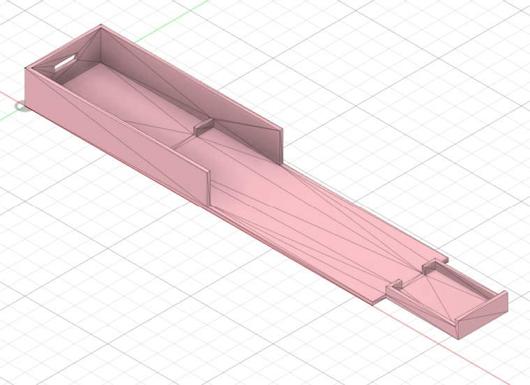
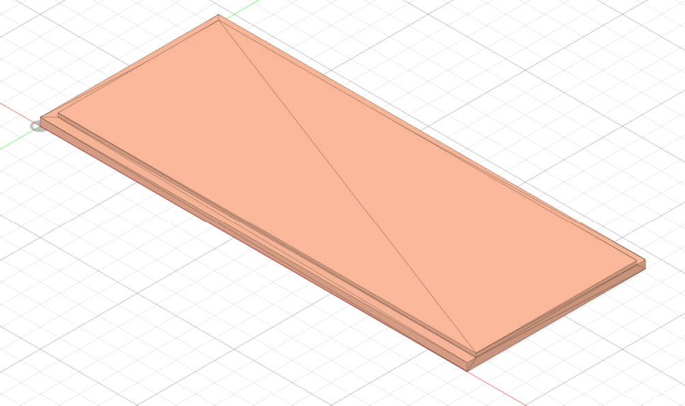
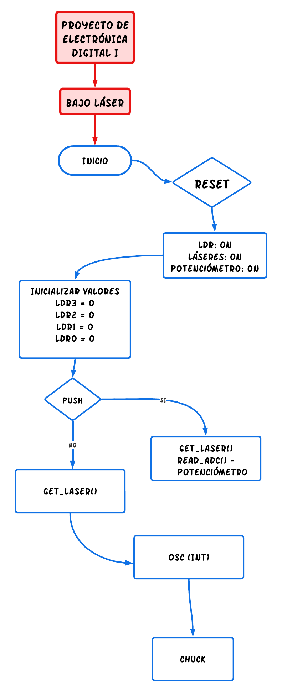
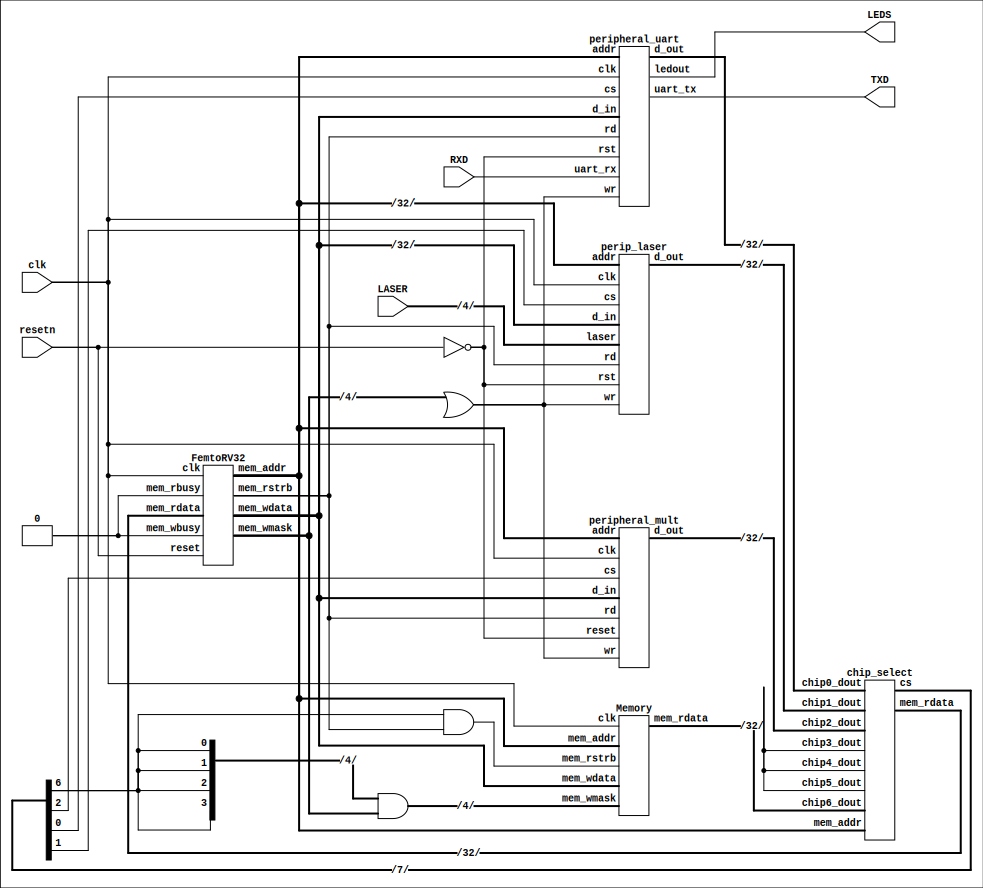

# Bajo Láser - Electrónica Digital I

El presente repositorio describe el desarrollo de un "bajo láser" como componente del sintetizador digital diseñado para la asignatura Electrónica Digital I. El grupo está conformado por:

- Jorge Hernan Arango Barragan
- Juan Felipe Gaitan Nocua
- Luciano Manrique Medina
- Samuel Mahecha Arango


El sistema se compone de cuatro módulos láser de punto (650 nm, 6 mm, 5 V, 5 mW, color rojo), orientados hacia cuatro sensores LDR (Sensores de luminosidad con fotoresistencia de salida digital). Cada sensor LDR entrega una señal de nivel alto cuando no se detecta una intensidad luminosa suficiente. Dicho umbral que puede ajustarse directamente en el módulo mediante un trimmer. Esta configuración permite que los haces láser funcionen como “cuerdas virtuales”, en donde al interrumpir alguno de ellos, el correspondiente LDR activa una señal de nivel alto, la cual es enviada directamente a la FPGA (BlackIce40), simulando el efecto de pulsar una cuerda en un instrumento tradicional, en este caso el de un bajo. Para el correcto desempeño del làser se desarrolló una estructura mediante impresión 3D, de tal manera que el laser se encuentre en una posición fija y que efectivamente le llegue toda la luz a la fotorresistencia; también la estructura propicia un ambiente controlado al fotorresistor para que no se vea afectado ante las diversas condiciones lumínicas del ambiente.




Además, se incorpora un potenciómetro en un divisor de tensión que genera una señal analógica proporcional a su resistencia. Esta señal es digitalizada mediante el ADC de un ESP32 y convertida a un número binaria de 10 bits, que se transfiere a la FPGA. El valor binario representa la "altura" sobre el mástil de un bajo, permitiendo modificar la frecuencia de la nota según la tensión recibida, tal como ocurre al presionar una cuerda en diferentes trastes. 

## Introducción

Este repositorio hace parte del proyecto de un sintetizador, que incorpora distintos instrumentos realizados por los estudiantes que se comunican a través de una FPGA y que a través de [Chuck](https://github.com/ccrma/chuck) se genere música.

Específicamente en este repositorio se encuentra un módulo que busca simular un bajo a través de láseres, fotorresistencias y potenciometros.

Este proyecto busca construir un instrumento digital experimental, donde se tienen unos módulos láser económicos simulan las cuerdas de un bajo eléctrico. Cuando una persona interrumpe uno de estos rayos láser con la mano, se genera una señal que será interpretada como si se hubiese pulsado una cuerda, activando una respuesta digital.

En la carpeta "femtoriscvBase" se tiene el programa funcional en el cual se recibe la señal de los modulos fotoresistores que simula el toque de una cuerda, que en este caso se imprime desde la consola como un numero decimal de 0 a 15. Falta implementar la comunicacion por el protocolo OSC para enviar los datos de las cuerdas a chunk y que por alli mismo se programe la nota, por ahora aleatoria ya que no conocemos si existe alguna libreria de sonidos en chunk en la cual hallan sonidos de bajo.

En la carpeta de ejemplos de desarrollo, especificamente en el archivo "femtoriscvINTENTOS" se tienen los intentos autonomos para la programacion del potenciometro, el cual tendria el objetivo de variar la frecuencia de las notas que han sido tocadas por las cuerdas (las que son funcionales en femtoriscvV2). EL problema que tenemos es que no hemos podido integral el potenciometro a la FPGA asi como lo esta en programa de las cuerdas. Por ahora lo unico que se muestra en consola (al correr mpremote o picocom) son los datos del ADC entre 0 y 1024 datos.

## Funcionamiento 

El módulo tiene 4 láseres que representan cada una de las cuerdas de un bajo, estos láseres siempre se encuentran encendidos; cuando el usuario interrumpa la luz de uno de los laseres, la fotorresistencia cambiará su estado y el efecto que tendrá será el de tocar la cuerda, de igual manera la interrupción de dos o más laseres a la vez se interpretará como el toque de más de una cuerda, por lo que sonará una nota diferente en cada combinación. 
Por otra parte, a través de un potenciometro

## Requerimientos funcionales

- Uso de LDR para la generación de una fuente de luz estable.
- Implementación de un modulo con fotorresistencia incorporada para medir cuando se toca una nota.
- Generación de nota MIDI con chuck
- Uso de del chip SoC ESP32 como transmisor de datos entre la FPGA a través de red wifi.

## Diagrama de flujo



Una vez el programa se inicializa y presionado el botón de Reset de la FPGA, se activarán los módulos laser, de LDR y el potenciómetro, de tal manera que el programa asigna de forma predeterminada como una salida a nivel BAJO del LDR de 4 bits (0000), después, si se presiona un pulsador, entonces se leerá tanto el potenciometro como la salida de los láseres, de lo contrario solo se tendrá en cuenta lo registrado por el láser a través de la funciòn `Get_Laser()`, la cual recibirá una entrada binaria y posteriormente realizará una conversión de binario a decimal para en seguida enviar la información procesada al Chuck mediante el protocolo OSC via Wi-Fi. Cuando se presione el pulsador, el ADC del ESP32 leerá el valor de tensión que cae en el potenciometro y a este se le asignará un valor binario de 12 bits, de tal forma que al Chuck obtendrá la información tanto del láser como del potenciometro. En la secciòn final de "Explicación de conexión con Chuck", se comentará detalladamente el procesamiento de la información recibida por Chuck.

## Diagrama RTL




## Simulación verilog-gtkwave


Como se observa, cuando la variable de read (rd) y la de chipset se encuentre encendida, luego, la salida `d_out` pasa de un estado indeterminado (`XXX`) a un valor `0x0000000A` de dirección de memoria, que corresponde correctamente al valor del laser.

## Logs


## Explicación de conexión con Chuck

Cada laser genera una nota en binario, que en total con los 4 laseres son 4 bits, por lo que se generan valores de 0 a 15 en decimal que son enviadas por medio de la ESP32 hacia la FPGA por el puerto UART para luego ser enviadas usando el protocolo OSC y finalmente procesar estos valores en Chuck.

En el procesamiento de los valores de cada laser, se definió a cada laser como la representación una nota que apunta a un valor de MIDI, yendo de esa forma de la nota más aguda a la más grave. Se recalca las notas principales de cada laser de forma individual: 

Para la combinación 0001, se tiene un Mi (64), para 0010 un La (69), para 0100 un Re (62), para 1000 Sol (67), para valores intermedios se tienen configurados otros valores.

Para todas la notas el volumen de sonido se mantiene constante y la duración de cada nota es de 250ms.

El siguiente fragmento de código pertenece a parte de la logica principal realizada en chuck:

```
[0, 64, 69,60 , 62,61 ,63 ,65,67,66,68,69,70,71,72,73] @=> int arreglo[];

if (msg.address == "/dev1/piano") {
                arreglo[amsg.getInt(0)] => int note;
                <<< "Nota de piano recibida:", note >>>;
                spork ~ playPiano(note);
            }
```

Se difinieron las 16 notas MIDI pertenecientes a las combinaciones posibles entre las 4 cuerdas, tomando en cuenta que el valor de 0 en la lista "arreglo" no representa ningún sonido en específico ya que corresponde al caso donde no se está tocando ninguna cuerda. A través de un condicional, se verifica si las cuerdas están siendo tocadas; en caso de ser así, el dato entero recibido se convierte en el indice de una de las notas de la lista, procediendo con la respectiva reproducción de la nota indicada.

## Video de implementación

[]([https://youtu.be/wSBYV9-H8Fc](https://youtu.be/qhPJnRK_2KU))


