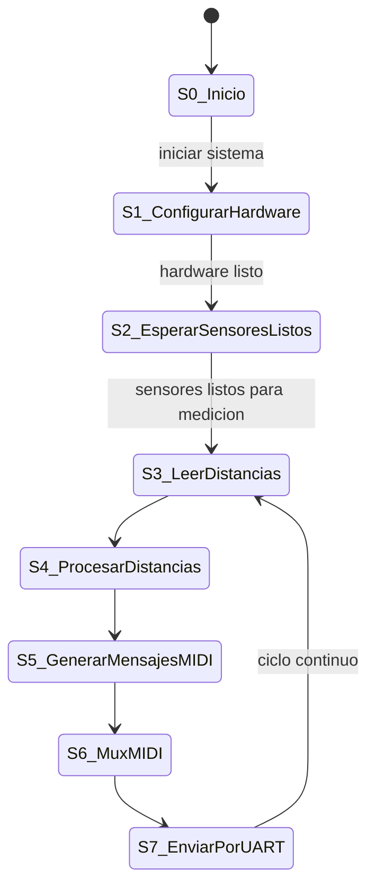

# THEREMIN (PROYECTO ELECTRÓNICA DIGITAL)
En el presente repositorio se expondrá en que conssitió el proyecto realizado en la aignatura de electrónica digital, mostrando el paso a paso realizado
- Dilan Mateo Torres Muñoz
- Arturo Moreno Covaría
- Nicolás Zarate Acosta
- 

Bienvenidos a nuestro repositorio del proyecto final de nuestra clase de electrónica digital de la Universidad Nacional de Colombia del semestre 2025-I, el cual consistía en el diseño y posterior implementación de  un theremin (instrumento musical), realizando una versión digital de este mismo mediante el uso de sensores ultrasónicos, FPGA y ESP32.

# Objetivos del proyecto
- Construir un diseño electrónico que detecte movimiento, en este caso que detecte el movimiento de la mano y la posición de ella mediante sensores ultrasónicos
- Diseñar un modelo que permita generar sonidos, con sus respectivas características (frecuencia y volumen) según la distancia detectada por el sensor.

# ¿Que es un theremin?

Un theremin es un instrumento musical electrónico inventado por Léon Theremin, que se caracteriza por ser tocado sin contacto físico directo. Se controla mediante el movimiento de las manos alrededor de dos antenas, una para el tono y otra para el volumen, alterando campos electromagnéticos.

# Planteamiento

## Requrimentos del proyecto:

### Requerimientos Funcionales

-  **Medición de distancia**
  - Se utilizan sensores ultrasónicos (HC-SR04) para medir distancia en centímetros.
  - Se usan dos sensores: uno para la nota y otro para el volumen.

- **Generación de nota MIDI**
  - Convierte la distancia medida en una nota MIDI válida (0–127).
  - Evita repetir la misma nota si no hay cambios.

- **Generación de volumen MIDI**
  - Escala la segunda distancia a un valor de velocidad (volumen) MIDI (0–127).

- **Codificación de mensajes MIDI**
  - Crea mensajes `Note On` y `Control Change` válidos según el estándar MIDI.

- **Transmisión UART**
  - Envía los datos MIDI usando UART a 31250 baudios, 8 bits, sin paridad, 1 bit de parada.

-  **Integración de módulos**
  - Un módulo principal (`top_module.v`) conecta todos los componentes del sistema.
  - El sistema opera sincronizado por una señal de reloj (`clk`).

---

###  Requerimientos No Funcionales

-  **Modularidad**
  - Cada funcionalidad está separada en módulos Verilog independientes.

-  **Simulación con testbenches**
  - Archivos de prueba (`midi_note_sender_tb.v`, `midi_volume_sender_tb.v`) simulan la entrada de distancias y verifican la salida MIDI.

-  **Simulación funcional**
  - Compatible con simuladores como Icarus Verilog + GTKWave.

-  **Escalabilidad**
  - El diseño permite la integración de más sensores o generación de otros mensajes MIDI.

-  **Código documentado**
  - Cada módulo está comentado para facilitar su comprensión y mantenimiento.

---

###  Potencial de Expansión: SoC Real

Aunque actualmente es un SoC lógico simulado, este proyecto puede escalarse a un **SoC físico embebido** mediante:

- Integración en un FPGA o ASIC
- Incorporación de un microcontrolador embebido (RISC-V, ARM)
- Soporte para memoria interna (RAM/ROM)
- Interfaz con sintetizadores reales por MIDI DIN o USB-MIDI

---

###  Módulos Verilog

| Archivo                  | Función |
|--------------------------|---------|
| `ultrasonic_sensor.v`    | Mide la distancia con sensores ultrasónicos |
| `midi_note_sender.v`     | Convierte distancia a nota MIDI |
| `midi_volume_sender.v`   | Convierte distancia a volumen MIDI |
| `uart_tx.v`              | Transmisor UART compatible MIDI |
| `top_module.v`           | Integra todos los módulos anteriores |
| `*_tb.v`                 | Testbenches para simular comportamiento |

---
## Diagrama ASM:

## Maquina de estados:

## Diagramas funcionales:

Esta máquina de estados orquesta la interacción entre los sensores ultrasónicos y la salida MIDI. Inicia configurando el hardware, luego mide distancias continuamente para procesarlas en valores MIDI. Finalmente, multiplexa y envía los mensajes MIDI resultantes a través de la UART.

# Máquina de Estados del Sistema MIDI

## Descripción de Estados

### S0_Inicio
**Estado inicial** del sistema al encender o reiniciar.

### S1_ConfigurarHardware
Realiza la configuración inicial de:
- Pines GPIO para sensores HC-SR04 (Trigger/Echo)
- Pines UART para comunicación MIDI
- Otros periféricos del ESP32

### S2_EsperarSensoresListos
Espera hasta que:
- Los sensores ultrasónicos estén listos para nueva medición
- O hayan completado una medición anterior
- Indicado por señales `distance_ready`

### S3_LeerDistancias
- Activa pulsos de disparo (`trigger1`, `trigger2`)
- Espera respuestas de eco (`echo1`, `echo2`)
- Calcula distancias (`distancia_tono`, `distancia_volumen`)

### S4_ProcesarDistancias
Convierte distancias medidas a valores MIDI:
- `distancia_tono` → nota MIDI
- `distancia_volumen` → volumen MIDI
- Usa lógica de escalado de `midi_note_sender` y `midi_volume_sender`

### S5_GenerarMensajesMIDI
Ensambla bytes MIDI:
- Status byte
- Note number/Control number  
- Velocity/Value
- Procesado en módulos `midi_note_sender` y `midi_volume_sender`

### S6_MuxMIDI
Lógica de multiplexación:
- Selecciona mensaje con prioridad (`midi_byte_mux`)
- Gestiona conflictos cuando ambos módulos intentan enviar
- Usa señales `midi_send_mux`

### S7_EnviarPorUART
Transmisión serial:
- Envía `midi_byte_mux` por UART
- Gestiona señal `midi_send_mux`
- Espera disponibilidad UART (`uart_ready`)
- Vuelve a S2_EsperarSensoresListos al completar

## Diagrama RTL del SoC y su mòdulo:
## Simulaciones:
Se simularos los modulos mencionados anteriormente:
### Simulacion midi_note_sender.v:

El módulo `midi_note_sender.v`  convierte una distancia (`distance_cm`) en una nota MIDI y la envía como un mensaje "Note On" a través de UART.

**Funcionamiento:**
1.  **Cálculo de Nota:** En `IDLE`, con `distance_ready` activo, calcula la `note`:
    * `< 5 cm`: `note = 80`
    * `> 60 cm`: `note = 50`
    * `5-60 cm`: `note` se escala inversamente de 80 a 50.
2.  **Envío MIDI (secuencial):** Envía 3 bytes si `uart_ready` está activo:
    * **1er Byte:** `0x90` (Note On, Canal 1).
    * **2do Byte:** La `note` calculada.
    * **3er Byte:** `0x64` (Velocidad 100).
3.  **Control de Envío:** `midi_send` se activa por un ciclo de reloj por cada byte enviado.

**Análisis de Simulación (con `distance_cm = 20`):**

La simulación es **consistente** con el código.

* **Cálculo:** `note` se calcula como `72` (`0x48`).
* **Secuencia de Envío (con `midi_send` activo):**
    1.  `midi_byte` = `0x90`
    2.  `midi_byte` = `0x48` (la nota 72)
    3.  `midi_byte` = `0x64` (velocidad 100)

La simulación confirma el correcto funcionamiento.

### Simulacion midi_volume_sender.v:

El módulo `midi_volume_sender.v` convierte una distancia (`distance_cm`) en un valor de volumen MIDI y lo envía como un mensaje "Control Change" a través de UART.

**Funcionamiento:**
1.  **Cálculo de Volumen:** En `IDLE`, con `distance_ready` activo, calcula el `volume`:
    * `< 5 cm`: `volume = 127` (máximo)
    * `> 60 cm`: `volume = 0` (mínimo)
    * `5-60 cm`: `volume` se escala inversamente de 127 a 0.
2.  **Envío MIDI (secuencial):** Envía 3 bytes si `uart_ready` está activo:
    * **1er Byte:** `0xB0` (Control Change, Canal 1).
    * **2do Byte:** `0x07` (Control Number para Volumen Maestro).
    * **3er Byte:** El `volume` calculado.
3.  **Control de Envío:** `midi_send` se activa por un ciclo de reloj por cada byte enviado.

**Análisis de Simulación (con `distance_cm = 20`):**

La simulación es **consistente** con el código.

* **Cálculo:** `volume` se calcula como `93` (`0x5D`). Esto se puede verificar: `127 - ((20 - 5) * 127 / 55) = 127 - (15 * 127 / 55) = 127 - 34.63... = 92.36...` (entero 92). La simulación muestra `0x5D` (93), lo que indica un posible redondeo diferente o truncamiento. Asumiendo `93` es el resultado esperado.
* **Secuencia de Envío (con `midi_send` activo):**
    1.  `midi_byte` = `0xB0` (Status Byte).
    2.  `midi_byte` = `0x07` (Control Number).
    3.  `midi_byte` = `0x5D` (el volumen 93).

La simulación confirma el correcto funcionamiento del `midi_volume_sender.v`.

### Simulacion uart_tx.v:

El módulo `UART_TX.v` convierte datos paralelos de 8 bits (`data_in`) en una secuencia serial (`tx`) usando el protocolo UART, a una velocidad de baudios configurable (`BAUD_RATE`).

**Parámetros Clave:**
* `CLK_FREQ = 50_000_000 Hz` (frecuencia del reloj del sistema)
* `BAUD_RATE = 31_250 bps` (velocidad de transmisión UART)
* `CLK_PER_BIT = CLK_FREQ / BAUD_RATE = 50_000_000 / 31_250 = 1600` (ciclos de reloj por bit de UART).

**Funcionamiento General:**
1.  **Estado Inicial/Reposo (`ready = 1`):** `tx` está en alto (estado de reposo UART).
2.  **Inicio de Transmisión:** Cuando `send` es alto y `ready` es alto:
    * El bit de inicio (`0`), los 8 bits de `data_in`, y el bit de parada (`1`) se cargan en `shift_reg` (formato `{1'b1, data_in, 1'b0}`).
    * `sending` se activa.
    * `ready` se desactiva (ocupado).
    * Contadores se reinician.
3.  **Transmisión de Bits (`sending = 1`):**
    * Se cuenta `CLK_PER_BIT` ciclos de reloj para cada bit.
    * Cada vez que `clk_count` llega a `CLK_PER_BIT - 1`:
        * El bit menos significativo de `shift_reg` se envía a `tx`.
        * `shift_reg` se desplaza a la derecha.
        * `bit_index` se incrementa (de 0 a 9, para 10 bits: Start + 8 data + Stop).
4.  **Fin de Transmisión:** Cuando `bit_index` llega a 9 (el último bit, el bit de parada, ha sido enviado):
    * `sending` se desactiva.
    * `ready` vuelve a activarse (listo para la siguiente transmisión).
    * `tx` queda en alto (estado de reposo).

**Análisis de Simulación (con `data_in = 0xA5`):**

La simulación es **consistente** con el código.

* **Reset:** `rst` inicializa `tx = 1` y `ready = 1`.
* **Inicio (aprox. 20 µs):**
    * `data_in` es `0xA5` (`10100101` binario).
    * `send` se activa mientras `ready` es alto.
    * `ready` pasa a bajo.
    * El `shift_reg` se carga con `{1'b1, 10100101, 1'b0}` lo que es `1101001010` (Stop + Data + Start).
* **Transmisión (desde ~20 µs hasta ~180 µs):**
    * `tx` se pone a `0` (bit de inicio) y permanece así por 1600 ciclos de reloj (`~32 µs`).
    * Luego, `tx` transmite los bits de `data_in` de LSB a MSB, seguidos del bit de parada, cada uno durando `~32 µs`.
        * `tx` = `0` (Start Bit)
        * `tx` = `1` (LSB de `0xA5` -> `1010010**1**`)
        * `tx` = `0` (siguiente bit -> `101001**0**1`)
        * `tx` = `1` (siguiente bit -> `10100**1**01`)
        * `tx` = `0` (siguiente bit -> `1010**0**101`)
        * `tx` = `0` (siguiente bit -> `101**0**0101`)
        * `tx` = `1` (siguiente bit -> `10**1**00101`)
        * `tx` = `0` (siguiente bit -> `1**0**100101`)
        * `tx` = `1` (MSB de `0xA5` -> `**1**0100101`)
        * `tx` = `1` (Stop Bit)
* **Fin de Transmisión (aprox. 180 µs):** `ready` vuelve a `1`, indicando que el módulo está listo para la siguiente transmisión. `tx` permanece en `1`.

La simulación muestra una transmisión UART correcta de `0xA5` (Start bit `0`, Data bits `10100101` (LSB first), Stop bit `1`).

### Simulacion ultrasonic_sensor.v:

El módulo `ultrasonic_sensor.v`  convierte datos paralelos de 8 bits (`data_in`) en una secuencia serial (`tx`) usando el protocolo UART, a una velocidad de baudios configurable (`BAUD_RATE`).

**Parámetros Clave:**
* `CLK_FREQ = 50_000_000 Hz` (frecuencia del reloj del sistema)
* `BAUD_RATE = 31_250 bps` (velocidad de transmisión UART)
* `CLK_PER_BIT = CLK_FREQ / BAUD_RATE = 50_000_000 / 31_250 = 1600` (ciclos de reloj por bit de UART).

**Funcionamiento General:**
1.  **Estado Inicial/Reposo (`ready = 1`):** `tx` está en alto (estado de reposo UART).
2.  **Inicio de Transmisión:** Cuando `send` es alto y `ready` es alto:
    * El bit de inicio (`0`), los 8 bits de `data_in`, y el bit de parada (`1`) se cargan en `shift_reg` (formato `{1'b1, data_in, 1'b0}`).
    * `sending` se activa.
    * `ready` se desactiva (ocupado).
    * Contadores se reinician.
3.  **Transmisión de Bits (`sending = 1`):**
    * Se cuenta `CLK_PER_BIT` ciclos de reloj para cada bit.
    * Cada vez que `clk_count` llega a `CLK_PER_BIT - 1`:
        * El bit menos significativo de `shift_reg` se envía a `tx`.
        * `shift_reg` se desplaza a la derecha.
        * `bit_index` se incrementa (de 0 a 9, para 10 bits: Start + 8 data + Stop).
4.  **Fin de Transmisión:** Cuando `bit_index` llega a 9 (el último bit, el bit de parada, ha sido enviado):
    * `sending` se desactiva.
    * `ready` vuelve a activarse (listo para la siguiente transmisión).
    * `tx` queda en alto (estado de reposo).

**Análisis de Simulación (con `data_in = 0xA5`):**

La simulación es **consistente** con el código.

* **Reset:** `rst` inicializa `tx = 1` y `ready = 1`.
* **Inicio (aprox. 20 µs):**
    * `data_in` es `0xA5` (`10100101` binario).
    * `send` se activa mientras `ready` es alto.
    * `ready` pasa a bajo.
    * El `shift_reg` se carga con `{1'b1, 10100101, 1'b0}` lo que es `1101001010` (Stop + Data + Start).
* **Transmisión (desde ~20 µs hasta ~180 µs):**
    * `tx` se pone a `0` (bit de inicio) y permanece así por 1600 ciclos de reloj (`~32 µs`).
    * Luego, `tx` transmite los bits de `data_in` de LSB a MSB, seguidos del bit de parada, cada uno durando `~32 µs`.
        * `tx` = `0` (Start Bit)
        * `tx` = `1` (LSB de `0xA5` -> `1010010**1**`)
        * `tx` = `0` (siguiente bit -> `101001**0**1`)
        * `tx` = `1` (siguiente bit -> `10100**1**01`)
        * `tx` = `0` (siguiente bit -> `1010**0**101`)
        * `tx` = `0` (siguiente bit -> `101**0**0101`)
        * `tx` = `1` (siguiente bit -> `10**1**00101`)
        * `tx` = `0` (siguiente bit -> `1**0**100101`)
        * `tx` = `1` (MSB de `0xA5` -> `**1**0100101`)
        * `tx` = `1` (Stop Bit)
* **Fin de Transmisión (aprox. 180 µs):** `ready` vuelve a `1`, indicando que el módulo está listo para la siguiente transmisión. `tx` permanece en `1`.

La simulación muestra una transmisión UART correcta de `0xA5` (Start bit `0`, Data bits `10100101` (LSB first), Stop bit `1`).

### Simulacion top_module.v:

El módulo `top_module` coordina dos sensores ultrasónicos para generar mensajes MIDI (notas y volumen) y enviarlos a través de una UART.

**Componentes Integrados:**
* **`sensor_tono` (ultrasonic_sensor):** Mide la distancia para controlar la nota MIDI.
* **`sensor_volumen` (ultrasonic_sensor):** Mide la distancia para controlar el volumen MIDI.
* **`note_midi` (midi_note_sender):** Convierte `distancia_tono` en un mensaje MIDI "Note On".
* **`volume_midi` (midi_volume_sender):** Convierte `distancia_volumen` en un mensaje MIDI "Control Change" para el volumen.
* **`uart` (uart_tx):** Transmite los bytes MIDI serialmente.

**Lógica de Multiplexación MIDI:**
* Un bloque `always @(*)` prioriza el envío de mensajes MIDI:
    * Si `midi_send_note` está activo (el sensor de tono está enviando un byte), `midi_byte_mux` toma el valor de `midi_byte_note` y `midi_send_mux` se activa.
    * Si `midi_send_note` no está activo pero `midi_send_vol` sí, `midi_byte_mux` toma el valor de `midi_byte_vol` y `midi_send_mux` se activa.
    * Si ninguno está enviando, `midi_send_mux` es 0.
* `uart_ready` (proveniente de `uart_tx`) es crucial, ya que los módulos `midi_note_sender` y `midi_volume_sender` solo avanzan y envían bytes cuando la UART está lista.

**Análisis de la Simulación:**

La simulación muestra el comportamiento esperado de integración, aunque las distancias se mantienen constantes en el fragmento visible:

* **Inicialización:** `rst` es activo al inicio, reiniciando todos los submódulos. `tx` se pone en alto, `uart_ready` en alto.
* **Activación Sensores:**
    * `trigger1` y `trigger2` generan pulsos para los sensores.
    * Los sensores calculan `distancia_tono` y `distancia_volumen` (ambos en `0x0014` = 20 cm en el ejemplo).
    * `listo_tono` y `listo_volumen` se activan cuando las distancias están listas.
* **Envío de Mensajes MIDI:**
    * Debido a `listo_tono` y `listo_volumen` activos, `note_midi` y `volume_midi` intentan enviar sus respectivos mensajes.
    * **Prioridad:** El bloque `always @(*)` decide qué byte se envía a la UART. En el fragmento visible, `midi_send_note` parece ser prioritario (o el primero en activarse).
    * Se observa que `midi_byte_mux` toma valores y `midi_send_mux` se activa, lo que a su vez impulsa la transmisión en `uart_tx`.
    * `uart_ready` sube y baja, coordinando los envíos.

**Comportamiento Esperado (basado en código previo y simulación):**
* Con `distance_cm = 20`, `note_midi` calcularía una nota de `72` (`0x48`). El mensaje Note On sería `0x90`, `0x48`, `0x64`.
* Con `distance_cm = 20`, `volume_midi` calcularía un volumen de `93` (`0x5D`). El mensaje Control Change sería `0xB0`, `0x07`, `0x5D`.
* La simulación muestra las líneas de control (`midi_send_note`, `midi_send_vol`) y los datos multiplexados (`midi_byte_mux`) reaccionando a las entradas y la disponibilidad de la UART. La señal `tx` muestra la salida serial combinada.

En general, la simulación demuestra la integración y el flujo de datos entre los distintos módulos para implementar el sistema de control MIDI por distancia.

## Video simulacion: 
## Logs de make log-prn, make log-syn
## ¿Còmo interactùa con entornos externos?
## Video del proyecto
